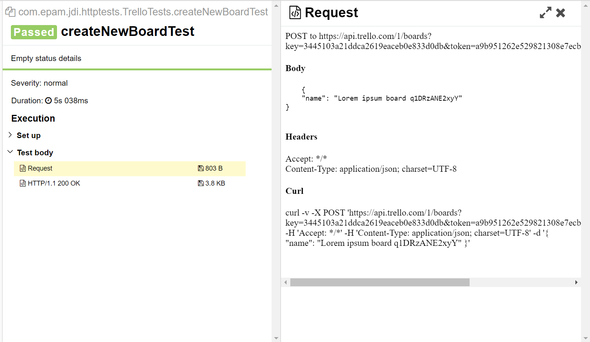
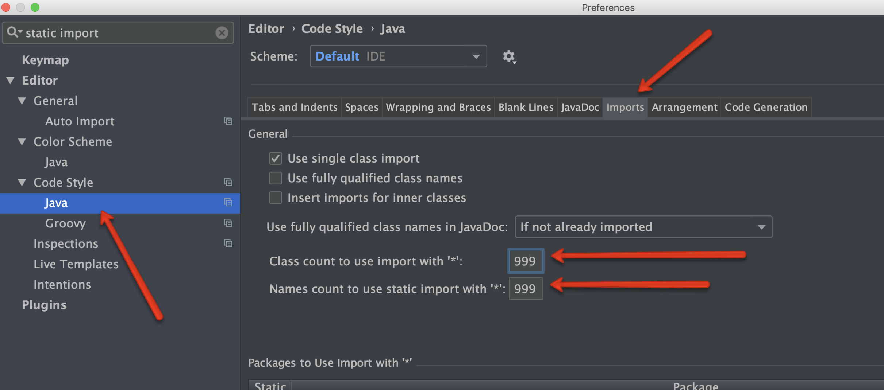

# Documentation
## Framework usage

```
import static com.epam.http.requests.ServiceInit.init;
```

For effective usage of JDI Dark framework it is recommended to statically import the init() method of ServiceInit class.

This is an entry point for initialising your Service Object class.
## HTTP methods
JDI Dark supports the following HTTP methods:

 - GET
 - POST
 - PUT
 - PATCH
 - DELETE
 - OPTIONS
 - HEAD

For all of these methods there are annotations named after methods in *com.epam.http.annotations.** package.
All of these annotations take a value of URI to make request call to. Those annotations are supposed to be used in your Service Object class.

To point the base URI of your service it's convenient to use *@ServiceDomain* annotation with provided URL as a value.
Then values in your methods annotations might be just specific URL paths.
## Request Data
You might need to use specific request data in your requests. Cookies, headers, query parameters and Content-type are available in annotation form.
So you can specify them in your Service Object class with provided name and value.

There is a class *com.epam.http.requests.RequestData.** which represents the data being sent with request.

It is also possible to specify request data when making a request call.
### Request body

```java
public static RequestData requestBody(String body)
public static RequestData requestData(JAction1<RequestData> valueFunc)
 ```
 
Request body can be set when making a request call. Just pass it as argument to the *call()* method or within the RequestData object,
that contains the next fields:

 - String url
 - String body
 - ContentType contentType
 - MapArray<String, String> headers
 - MapArray<String, String> pathParams
 - MapArray<String, String> queryParams
 - MapArray<String, String> cookies

All of these fields can be set/updated from call() method as well.

You may need to statically import *com.epam.http.requests.RequestData.** package.

 ```java
public RestResponse call(RequestSpecification requestSpecification) 
 ```

There is also support to make a request call with Rest Assured request specification.
### Path parameters

```java
@ContentType(JSON) @GET("/boards/{board_id}")
static RestMethod getBoardById;

@ContentType(JSON) @GET("/boards/{board_id}/cards/{short_card_id}/")
static RestMethod getBoardCardById;

@Test
public void getBoardById() {
    RestResponse response = getBoardById
        .call(requestPathParams("board_id", BOARD_ID));
    response.isOk().body("id", equalTo(BOARD_ID));
}

@Test
public void getCardByShortId() {
    getBoardCardById.call(requestPathParams(new Object[][] {{"board_id", BOARD_ID}, {"short_card_id", "1"}}))
        .isOk().assertThat().body("name", equalTo("Lorem ipsum dolor sit amet"));
}
```

A URL can have one or several path parameters, each denoted with curly braces, e.g. */get/{board_id}*, */boards/{board_id}/cards/{short_card_id}/*. You can use them in your Service Object methods and 
replace it with values when making a request call.

There are methods provided for such cases:

|Method | Description | Return Type
--- | --- | ---
**requestPathParams(String paramName, String paramValue)** | pass one parameter to a path | RequestData
**requestPathParams(Object[][] params)** | pass several parameters to a path | RequestData


## Tests without Service Object

```java
public static RestResponse GET(RequestData data)
public static RestResponse GET(String url)
public static RestResponse GET(String url, RequestSpecification requestSpecification) 
```

All the HTTP methods mentioned before are available not only in annotation form.
There are the same methods accessible from *com.epam.http.requests.RestMethods.** with several signatures.

You can call these methods with either of given arguments:

 - *com.epam.http.requests.RequestData*
 - String URL
 - Rest Assured request specification: *io.restassured.specification.RequestSpecification*


## Tests with Service Object
### Create service

```java
@ServiceDomain("https://httpbin.org/")
public class ServiceExample {
    @ContentType(JSON) @GET("/get")
    @Headers({
        @Header(name = "Name", value = "Roman"),
        @Header(name = "Id", value = "Test")
    })
    static RestMethod<Info> getInfo;

    @Header(name = "Type", value = "Test")
    @POST("/post")
    RestMethod postMethod;

    @PUT("/put") RestMethod putMethod;
    @PATCH("/patch") RestMethod patch;
    @DELETE("/delete") RestMethod delete;
    @GET("/status/%s") RestMethod status;

} 
```

It's possible to describe tested web service as Service Object class using annotations.
<br />
<br />
<br />
<br />
<br />
<br />
<br />
<br />
<br />
<br />
<br />
<br />
<br />
<br />
<br />
<br />
<br />
<br />
<br />

### Create tests for service

```java
public class ServiceTest {

    private ServiceExample service;

    @BeforeClass
    public void before() {
        service = init(ServiceExample.class);
    }

    @Test
    public void simpleRestTest() {
        RestResponse resp = ServiceExample.getInfo.call();
        resp.isOk().
                body("url", equalTo("https://httpbin.org/get")).
                body("headers.Host", equalTo("httpbin.org")).
                body("headers.Id", equalTo("Test"));
        resp.assertThat().header("Connection", "keep-alive");
    }

    @Test
    public void serviceInitTest() {
        RestResponse resp = service.postMethod.call();
        resp.isOk().assertThat().
                body("url", equalTo("https://httpbin.org/post")).
                body("headers.Host", equalTo("httpbin.org"));
    }

}
```

This class can be initialized in tests.
Fields of initialized object can be used to send requests from tests.
<br />
<br />
<br />
<br />
<br />
<br />
<br />
<br />
<br />
<br />
<br />
<br />
<br />
<br />
<br />
<br />
<br />
<br />
<br />
<br />
<br />
<br />
<br />
<br />
<br />
<br />
<br />
<br />

### Use predefined RestSpecification

```java
public class ServiceTest {

    private RequestSpecification requestSpecification;
    private ServiceExample service;

    @BeforeClass
    public void before() {
        requestSpecification = given().filter(new AllureRestAssured());
        requestSpecification.auth().basic("user", "password");
        service = init(ServiceExample.class, requestSpecification);
    }
}
```

It's possible to setup used RestSpecification. 
Predefined settings will be used in all endpoints of that service.
In this example basic-auth credentials will be passed to all endpoints.  
<br />
<br />
<br />
<br />
<br />
<br />
<br />
<br />
<br />
<br />
<br />
<br />

## Response data

```java
public ValidatableResponse isOk()
public ValidatableResponse hasErrors()
public ValidatableResponse isStatus(ResponseStatusType type)
public RestResponse assertStatus(ResponseStatus rs)
public ValidatableResponse isEmpty()
```

```java
public ValidatableResponse assertBody(MapArray<String, Matcher<?>> params)
public ValidatableResponse assertBody(Object[][] params)
```

```java
public String getFromHtml(String path)
```

```java
public Response getRaResponse()
public ValidatableResponse assertThat()

public Map<String, String> cookies()
public String cookie(String name)
public Headers headers()
public String header(String name)

public String getBody()
public ResponseStatus getStatus()
public String getContentType() 

```

```java
RestResponse response = JettyService.getHello.call();
assertThat(response.body, containsString("{\"hello\":\"Hello Scalatra\"}"));
String body = response.getBody();

String hello = JettyService.getHello.call().getRaResponse().jsonPath().getString("hello");
```

The class **com.epam.http.response.RestResponse** represents the Response data in JDI Dark.

Below listed the methods that allows to work with response data:

**isOk()** and **hasErrors()** -  verify that status code is 2** or 4**, respectively.

**isStatus(ResponseStatusType type)** and **assertStatus(ResponseStatus rs)** - verity response status type and response 
status respectively against expected result. 

**assertBody(Object[][] params)** and **assertBody(MapArray<String, Matcher<?>> params)** - allow to verify response body

**cookies()** and **headers()** - return response cookies and headers values.

**cookie(String name)** and **header(String name)** - return cookie and header values respectively corresponding to specified name.

**getFromHtml()** -  returns html content of the page by provided path.

**getRaResponse()** and **assertThat()** returns Rest Assured Response and ValidatableResponse, 
so it is possible to use Rest Assured methods for validating the response body.

**getBody()**, **getStatus()**, **getContentType()** - allow get response body, status and content type. 
Response body and status can be also retrieved using fields *body* and *status* of RestResponse class.

**isEmpty()** - verifies that response body is empty.


## Headers

JDI Dark supports headers addition to Service endpoints using annotations.

### Single header can be added with usage of @Header annotation:

```java
@GET("/header")
@Header(name = "Header_name", value = "Header_value2")
public static RestMethod getHeader;
```
Here's a simple example of adding a header to an endpoint
<br />
<br />
<br />


### Multiple headers are also supported through @Headers annotation:

```java
@GET("/multiHeaderReflect")
@Headers({@Header(name = "Header_name", value = "Header_value"),
@Header(name = "Header_name2", value = "Header_value2")})
public static RestMethod getMultiHeaderReflect;
```
<br />
<br />
<br />
<br />

### Headers with same name, with no value and with multiple values can be added as well.

```java
@GET("/header")
@Headers({@Header(name = "Header_name", value = "Header_value"),
@Header(name = "Header_name", value = "Header_value2")})
public static RestMethod getHeader;


@GET("/header")
@Header(name = "some_header")
public static RestMethod getHeaderWithNoValue;


@GET("/multiHeaderReflect")
@Header(name = "MultiValueHeader", value = "Header_value_1", additionalValues = "Header_value_2")
public static RestMethod getMultiValueHeader;
```
@Headers annotation is used to add 2 headers with the same name "Header_name"
<br />
<br />
<br />
<br />
<br />
@Header is used in this example to pass a header with name only
<br />
<br />
<br />
<br />
@Header is used here to pass mutivalue header
<br />
<br />

### Methods to add Headers to Request Data. 
Headers can be passed as strings, as header objects, as maps, as arrays of objects.
Headers without value and with multiple values can be added as well.

```java
public RequestData addHeader(String name, String value, String... additionalValues)
public RequestData addHeader(String name)
public RequestData addHeaders(String name, Object value, Object... cookieNameValuePairs)
public RequestData addHeaders(Object[][] objects)
public RequestData addHeaders(MapArray mapArray)
public RequestData addHeaders(Map map)
public RequestData addHeaders(List<Header> headers)
public RequestData addHeaders(Header... headers)

RestResponse response = MyService.getHello.call(requestData(
                requestData -> requestData.addHeader("Header_example", "Test_value")));
```

|Method | Description | Return Type
--- | --- | ---
**addHeader(String name, String value, String... additionalValues)** | pass name and value of the header. If additional values are specified than several cookies will be created with same name (multivalue header) | RequestData
**addHeader(String name)** | pass name of a header without value | RequestData
**addHeaders(Object[][] objects)** | pass array with header names and values | RequestData
**addHeaders(MapArray mapArray)** | pass MapArray with header names and values | RequestData
**addHeaders(Map map)** | pass map with header names and values | RequestData
**addHeaders(Map map)** | pass map with header names and values | RequestData
**addHeaders(List list)** | pass list of headers | RequestData
**addHeaders(Header... header)** | pass header object | RequestData

## Cookies

JDI Dark supports addition of Cookies to Service endpoints.

Cookies with no value and with multiple values can be added as well.

```java
@GET("/cookie")
@Cookies({@Cookie(name = "username", value = "John"),
@Cookie(name = "token", value = "1234")})
public static RestMethod getCookie;


@GET("/cookie_with_no_value")
@Cookie(name = "some_cookie")
public static RestMethod getCookieWithNoValueWithCookies;

@GET("/multiCookieRequest")
@Cookie(name = "key1", value = "value1", additionalValues = "value2")
public static RestMethod getMultiCookieWithCookies;
```

There are methods to add cookies to Request Data. Cookies can be passed as name and value, as name and value pairs, as maps, as arrays of objects.
Cookies without value and with multiple values can be added as well.

|Method | Description | Return Type
--- | --- | ---
**addCookie(String name, String value, String... additionalValues)** | pass name and value of cookie. If additional values are specified than several cookies will be created with same name (multivalue cookie) | RequestData
**addCookie(String name)** | pass name of cookie to cookie without value | RequestData
**addCookies(String name, Object value, Object... cookieNameValuePairs)** | pass several pairs of cookie name and value | RequestData
**addCookies(Object[][] objects)** | pass array with cookie names and values | RequestData
**addCookies(MapArray mapArray)** | pass MapArray with cookie names and values | RequestData
**addCookies(Map map)** | pass map with cookie names and values | RequestData

```java
public RequestData addCookie(String name, String value, String... additionalValues)
public RequestData addCookie(String name)
public RequestData addCookies(String name, Object value, Object... cookieNameValuePairs)
public RequestData addCookies(Object[][] objects)
public RequestData addCookies(MapArray mapArray)
public RequestData addCookies(Map map)

RestResponse response = MyService.getHello.call(requestData(
                requestData -> requestData.addCookie("key1", "value1")));
```
## Delete

For sending DELETE request you can use RestMethod class with @DELETE annotation.

```java
@DELETE("/body")
public static RestMethod deleteBody;
@DELETE("/cookie")
public static RestMethod deleteCookie;

@Test
public void deleteSupportsStringBody() {
    RestResponse response = deleteBody.call(requestBody(TEST_BODY_VALUE));
    response.assertThat().body(is(TEST_BODY_VALUE));
}

@Test
public void requestSpecificationAllowsSpecifyingCookie() {
    RestResponse response = deleteCookie.call(requestData(requestData ->
            requestData.addCookies(new MapArray<>(new Object[][]{
                    {USERNAME, FIRST_NAME_VALUE},
                    {TOKEN, TOKEN_VALUE}
            }))));
    assertEquals(response.body, "username, token");
}


```

|Method | Description | Return Type
--- | --- | ---
**call(RequestData requestData)**| make request with parameters indicated by Request Data | RestResponse

<br>
<a href="https://github.com/jdi-testing/jdi-dark/blob/master/jdi-dark-tests/src/test/java/com/epam/jdi/httptests/DeleteTest.java" target="_blank">Test examples in Java</a>
<br>

## Deserialization
```java
public T callAsData(Class<T> c)
public T asData(Class<T> c)
```

JDI Dark provides support for deserialization response into Java object. Just use method *callAsData()* instead of *call()* and provide the class as argument.
## Performance testing
```java
public static PerformanceResult loadService(long liveTimeSec, RestMethod... requests)
public static PerformanceResult loadService(RestMethod... requests)
public static PerformanceResult loadService(long liveTimeMSec, Map<RestMethod, Integer> weightRequests)
```

Simple performance testing is supported by JDI Dark. There is *com.epam.http.performance* package available that contains
several classes and methods for collecting requests statistics.

You can load your service and get average response time and number of fails comparing to amount of requests. Just use *loadService()* method with suitable signature. 
## Reporting
If you want to use Allure framework for reporting, JDI Dark has out-of-the-box support for generating attachments for Allure reports.
Just simply install Allure as you would always do, those attachments will be automatically added to report.

All test execution results are being saved to __base_directory/allure-results__ folder.

If you use maven, then you will need to configure Allure maven plugin to take results from appropriate folder.

```dtd
<configuration>
    <resultsDirectory>${basedir}/allure-results</resultsDirectory>
</configuration>
```

After generating allure results, the full request and response information will be attached to every test that was executed.

Here is the example of Allure report with attached request body:


## Access RestAssured
TBD

### Accessing RestAssured.config
Sometime for testing purposes some RestAssured configuration properties might be changed.
You can access RestAssured form the test or define desired properties in @BeforeTest.

In code snap we have an example of Test using default headers set in RestAssured config.

```java
    public void followsRedirectsWhileKeepingHeadersSpecifiedIfRestAssuredConfig() throws Exception {
        final List<Header> httpClientHeaders = new ArrayList<Header>();
        httpClientHeaders.add(new BasicHeader("header1", "value1"));
        httpClientHeaders.add(new BasicHeader("header2", "value2"));
        RestAssured.config = RestAssuredConfig.newConfig().httpClient(HttpClientConfig
                .httpClientConfig().setParam(DEFAULT_HEADERS, httpClientHeaders));
        RestResponse response = getRedirect.call(requestQueryParams("url", "multiHeaderReflect"));
        response.isOk();
        response.assertThat().header("header1", equalTo("value1"))
                .header("header2", equalTo("value2"));
        RestAssured.reset();
    }
```

## Review Guide

### Easy way to pass review
+ Good code style
+ No Wildcards imports (with asterisk *). You can use settings from the picture below

+ `Ctrl+Alt+O` & `Ctrl+Alt+L` in IDEA IDE before any commit
+ Right branch and label in PR

### Short checklist
1. Branch
2. Label
3. Codacy
4. *Other checks
5. Changed files

### Detailed list
1. Codacy check should be OK. If not then you need to see what's wrong
2. *When Travis would be fixed
3. Also reviewing files you can mark them with checkboxes. Should be checked:
   + Code style
   + Understandable naming
   + Unnecessary empty lines and spaces
   + Unnecessary or forgotten comments
   + Chaining should be separated by lines

### Recommended tools
1. Intellij IDEA
2. Git

### Using libraries
1. As log library: slf4j + logback-classic (TO_VERIFY)
2. As tests runner: TestNG (TO_VERIFY)
3. As reporter: Allure Framework (TO_VERIFY)
4. As test framework: JDI (TO_VERIFY)

### Intellij IDEA Preferences
1. Preferences -> Version Control -> Commit Dialog > Before commit block, setup checkboxes: Reformat Code, Rearrange code, Optimize imports
2. In app press hotkeys: `Ctrl+Shift+Alt+L`, choose checkboxes: Optimize imports, Rearrange Code
3. When you work to apply autoreformatting please use (on file, on directory or inside file) `Ctrl-Alt-L` hotkey
4. To fast open any class by its name use `Ctrl+N`/`Cmd+O`
5. Be sure that NOT checked: Settings->Editor-> Code Style -> Java -> Tabs and Indents -> Use tab character
6. Be sure that equals to 4: Settings->Editor-> Code Style -> Java -> Tabs and Indents -> Tab size field and Indent field
7. Turn off wildcard imports: set to 999 for Settings -> Editor -> Code style -> Java -> Imports -> Class count to use imports with `*` field and Names count to use static imports with `*`

### CVS section
1. Use Git
   + Name branches with useful names 
2. Merge code into any branch only through GitHub pull request (PR)
   + Name PR with useful name
3. Before add reviewers to your PR be ensure: 
   + no codacy issues
   + code is ready to review
   + you push the last changes
   + you have last changes from target branch
   + there is no merge conflicts
   + you take into account all review comments (if such were)
4. Add DarkReviewTeam as reviewers or re-request review (if there is already reviewers in PR)
5. When you get review changes request you should resolve all issues and re-request code review from the same reviewers
6. Repeat until branch will be merged by reviewers
7. Keep actual **.gitignore** file

### Code style
1. Use spaces, 1 tab size equals to 4
2. Don't use wildcard imports
3. Use Intellij's autoreformatting, imports optimization and rearrange option
4. Fix all Codacy issues
5. If Codacy issue shouldn't be resolved use warnings suppressions
6. Use semantic-value names for classes , variables, methods and so on. Use full version of words (human instead of h and so on). Common abbreviations (as id, uid and so on are applied). Use valuable names, for example instead of accountList use accounts and so on
7. Remove double empty lines, use empty lines only when it make sense (additionally to autoreformatting)
8. Use correct line breaks: (PROVIDE_SAMPLES)
9. Try to use lines with no more 100-120 symbols (including indents) 
10. Use chaining style, recommended sample:
```java 
object
    .method(1)
    .otherMethod();
```
11. Always use `{}` braces for even empty if, for, etc.
12. Follow to the sequence of keywords: public protected private abstract default static final transient volatile synchronized native strictfp
13. Don't use such conveniences as: `mValue`, `_value`, and so on. Acceptable `__` as unused argument of data provider in test methods
14. Feel free to smart refactoring
15. Feel free to use smart ?:
16. Use `UpperCamelCase` naming style for classes, `lowerCamelCase` for fields and methods, `UPPERCASE` for enums, `lowercase` for packages
17. Always use `@Override` annotation
18. Don't leave empty `catch{}`, use relevant exceptions with messages
19. Try to not use global variables
20. Use variables for integer, string and other values (for instance, `int piNumber=3.14; println(piNumber)`)
21. Write comments in English
22. It's better to write code than create task to write code
23. It's better to create task and `TODO` with this task number than to write simple `TODO` in code
24. It's better to write simple understandable `TODO` in code than to tell about problem to someone
25. It's better to tell about a problem to someone than to not take actions at all
26. Always leave newline symbol as a last symbol of file
