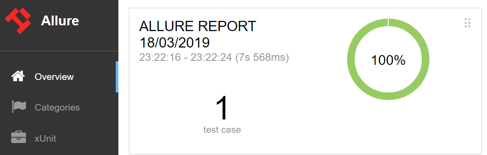
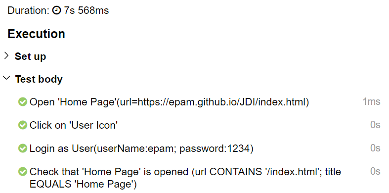

# JDI Framework
JDI – is powerfull Test Automation Framework that helps to makes your tests fast, sustainable and provide obvious and predictable test run result
JDI powered by Selenium and has simple integration with Selenium based projects

# Highlights
- Has simple integration with any Selenium based project that allows to increase projects stability, add user actions logs and enrich standard WebElements capabilities with new features in minutes (TBD add Guide)
- Extends Page Objects pattern with powerful UI Elements: Buttons, TextFields, Forms, Tables etc ( TBD add good links to examples)
- Write stable and predictable tests that fail only because of changing business logic or layout. No more waits, thread sleep and other flaky staff
- Increase your tests execution speed in general and especially for complex cases like search in big tables, dropdowns with hundreds elements or enter text with thousand lines
- Get detailed logs and good reports of all user actions with no effort
- All UI elements has assertions/matchers that powered by Hamcrest and wait expected condition during timeout
- Easy integration with all modern Automation tools: CI (Jenkins, TC etc.), Logging (Log4j or any other slf4j based logs), Reporting (Allure or Report Portal); Browser/Devices farms (Selenium Grid, Browser Stack, Selenoid etc.), Test Runners (TestNG, JUnit) etc.
